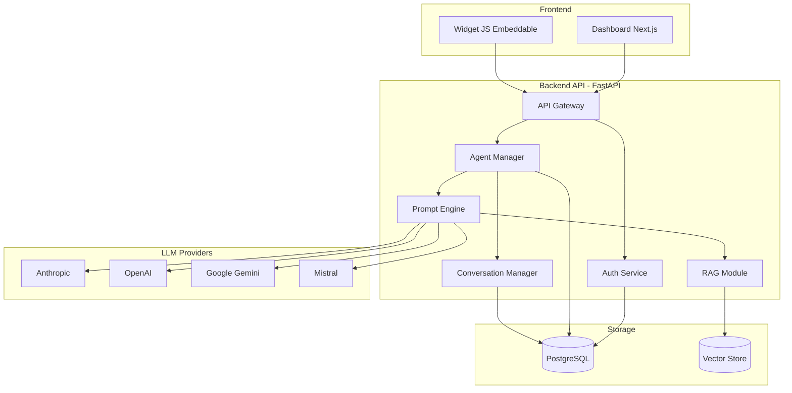

# Clone MILA — Plateforme d'Agents IA Customisables

## Contexte et Problème

Le projet **MILA 3.0.0** est une plateforme d'agents IA de support client livrée sous forme d'**images Docker pré-compilées** (closed-source). Voici ce que l'analyse révèle :

### Ce que contient MILA 3.0.0

| Composant | Technologie | Détails |
|-----------|------------|---------|
| **API** | Python (FastAPI/Uvicorn) | Module `support_ai`, Alembic migrations, port 8080 |
| **Dashboard** | Next.js (Node.js) | Interface admin, port 3000, standalone build |
| **Base de données** | PostgreSQL 16 | Stockage conversations, utilisateurs |
| **LLM** | Anthropic (Claude) | Via `ANTHROPIC_API_KEY` |
| **Widget** | JavaScript embeddable | Servi par l'API sur `/widget.js` |
| **Observabilité** | Langfuse (optionnel) | Traçage LLM |

### Pourquoi un "clone" est nécessaire

> [!IMPORTANT]
> **Vous ne pouvez PAS modifier MILA.** Les images Docker sont des binaires compilés sans code source. Vous ne pouvez pas :
> - Ajouter de nouveaux agents IA avec des prompts/comportements différents
> - Changer le modèle LLM (ex: passer à OpenAI, Mistral, Gemini)
> - Personnaliser l'interface du widget ou du dashboard
> - Ajouter des fonctionnalités (RAG, multi-tenant, analytics avancés)
> - Modifier la logique métier de l'agent

**La seule solution viable est de reconstruire la plateforme from scratch** avec une architecture ouverte et extensible.

---

## User Review Required

> [!WARNING]
> Ce projet est **conséquent** (estimé à 2-3 semaines de développement intensif). Il faut valider :
> 1. **Scope initial** — Voulez-vous tout reconstruire d'un coup ou commencer par un MVP ?
> 2. **LLM Provider** — Garder Anthropic uniquement ou supporter multi-provider (OpenAI, Gemini, Mistral) ?
> 3. **Hébergement cible** — Déploiement Docker local ? VPS ? Cloud (GCP/AWS) ?

## Open Questions

> [!IMPORTANT]
> 1. **Avez-vous accès au code source de MILA** quelque part (repo Git, backup) ? Ou bien vous n'avez que ce bundle Docker livré ?
> 2. **Quel est le cas d'usage principal ?** Support client pour Canal Com uniquement, ou plateforme multi-client/multi-agent ?
> 3. **Budget API LLM** — Quel provider LLM voulez-vous utiliser en priorité ?
> 4. **Base de données d'entraînement** — Avez-vous des documents/FAQ à utiliser comme base de connaissance pour les agents ?

---

## Architecture Proposée — "MILA Open"



---

## Proposed Changes

### 1. Backend API (FastAPI + Python)

Structure du projet :

```
mila-open/
├── backend/
│   ├── alembic/                    # Database migrations
│   │   ├── versions/
│   │   └── env.py
│   ├── alembic.ini
│   ├── app/
│   │   ├── __init__.py
│   │   ├── main.py                 # FastAPI app entry
│   │   ├── config.py               # Pydantic Settings
│   │   ├── database.py             # SQLAlchemy async engine
│   │   ├── models/                 # SQLAlchemy models
│   │   │   ├── user.py
│   │   │   ├── agent.py            # 🆕 Agent definition model
│   │   │   ├── conversation.py
│   │   │   └── message.py
│   │   ├── schemas/                # Pydantic schemas
│   │   │   ├── agent.py
│   │   │   ├── conversation.py
│   │   │   └── user.py
│   │   ├── api/                    # Route handlers
│   │   │   ├── v1/
│   │   │   │   ├── agents.py       # 🆕 CRUD agents
│   │   │   │   ├── chat.py         # Widget chat endpoint
│   │   │   │   ├── conversations.py
│   │   │   │   └── admin.py        # Dashboard admin endpoints
│   │   │   └── deps.py             # Dependencies (auth, db)
│   │   ├── services/
│   │   │   ├── llm/                # 🆕 Multi-provider LLM
│   │   │   │   ├── base.py         # Abstract LLM interface
│   │   │   │   ├── anthropic.py
│   │   │   │   ├── openai.py
│   │   │   │   ├── gemini.py
│   │   │   │   └── factory.py      # Provider factory
│   │   │   ├── agent_service.py    # 🆕 Agent management
│   │   │   ├── chat_service.py     # Conversation logic
│   │   │   ├── rag_service.py      # 🆕 RAG (optionnel)
│   │   │   └── user_service.py
│   │   ├── core/
│   │   │   ├── security.py         # JWT, API keys, bcrypt
│   │   │   └── middleware.py       # CORS, logging
│   │   └── widget/
│   │       └── widget.js           # Embeddable chat widget
│   ├── requirements.txt
│   ├── Dockerfile
│   └── docker-entrypoint.sh
```

#### [NEW] `backend/app/models/agent.py`
Modèle SQLAlchemy pour la définition des agents IA customisables :
- `id`, `name`, `slug` — Identité de l'agent
- `system_prompt` — Le prompt système qui définit le comportement
- `llm_provider` — Enum (anthropic, openai, gemini, mistral)
- `llm_model` — Nom du modèle spécifique (claude-3.5-sonnet, gpt-4o, etc.)
- `temperature`, `max_tokens` — Paramètres LLM
- `welcome_message` — Message d'accueil du widget
- `knowledge_base` — Documents RAG associés (JSON)
- `widget_config` — Personnalisation visuelle du widget (couleurs, position)
- `is_active`, `created_at`, `updated_at`

#### [NEW] `backend/app/services/llm/base.py`
Interface abstraite pour les providers LLM :
```python
class BaseLLMProvider(ABC):
    async def chat(self, messages, system_prompt, **kwargs) -> str: ...
    async def stream_chat(self, messages, system_prompt, **kwargs) -> AsyncIterator[str]: ...
```

#### [NEW] `backend/app/services/llm/factory.py`
Factory pattern pour instancier le bon provider selon la config de l'agent.

#### [NEW] `backend/app/api/v1/agents.py`
CRUD complet pour les agents :
- `POST /api/v1/agents` — Créer un agent
- `GET /api/v1/agents` — Lister les agents
- `GET /api/v1/agents/{slug}` — Détail d'un agent
- `PUT /api/v1/agents/{id}` — Modifier un agent
- `DELETE /api/v1/agents/{id}` — Supprimer un agent
- `POST /api/v1/agents/{id}/test` — Tester un agent en live

---

### 2. Dashboard (Next.js)

```
├── dashboard/
│   ├── src/
│   │   ├── app/
│   │   │   ├── layout.tsx
│   │   │   ├── page.tsx            # Redirect to /dashboard
│   │   │   ├── login/
│   │   │   ├── dashboard/
│   │   │   │   ├── page.tsx        # Overview stats
│   │   │   │   ├── agents/         # 🆕 Agent management
│   │   │   │   │   ├── page.tsx    # List agents
│   │   │   │   │   ├── new/        # Create agent wizard
│   │   │   │   │   └── [id]/       # Edit agent
│   │   │   │   ├── conversations/
│   │   │   │   └── settings/
│   │   ├── components/
│   │   │   ├── ui/                 # shadcn/ui components
│   │   │   ├── agent-builder/      # 🆕 Visual agent builder
│   │   │   │   ├── PromptEditor.tsx
│   │   │   │   ├── ModelSelector.tsx
│   │   │   │   ├── WidgetPreview.tsx
│   │   │   │   └── TestChat.tsx
│   │   │   └── layout/
│   │   └── lib/
│   │       ├── api.ts
│   │       └── auth.ts
│   ├── package.json
│   └── Dockerfile
```

#### [NEW] `dashboard/src/app/dashboard/agents/` 
Interface complète de gestion des agents avec :
- **Liste des agents** avec statut actif/inactif, stats d'utilisation
- **Wizard de création** : prompt système, choix du modèle LLM, paramètres, configuration widget
- **Éditeur de prompt** avec preview en temps réel
- **Chat de test** intégré pour tester l'agent avant déploiement
- **Aperçu du widget** avec personnalisation visuelle

---

### 3. Widget Chat Embeddable

#### [NEW] `backend/app/widget/widget.js`
Widget JavaScript auto-contenu :
- Chargeable via `<script>` tag avec `data-agent-slug`
- Bulle de chat flottante customisable
- Streaming de réponses
- Responsive (mobile/desktop)
- Personnalisable via la config de l'agent (couleurs, position, avatar)

---

### 4. Infrastructure Docker

#### [NEW] `docker-compose.yml`
```yaml
services:
  postgres:    # PostgreSQL 16
  api:         # FastAPI backend
  dashboard:   # Next.js frontend
  # Optional:
  pgvector:    # Vector store for RAG (future)
```

#### [NEW] `.env.example`
Variables d'environnement pour tous les providers LLM supportés.

---

## Phases de développement

### Phase 1 — MVP (Semaine 1) ✅ Recommandé pour commencer
- [ ] Backend API (FastAPI) avec auth, agents CRUD, chat
- [ ] Provider LLM Anthropic (compatible avec votre clé actuelle)
- [ ] Widget chat embeddable basique
- [ ] Dashboard login + liste conversations
- [ ] Docker Compose fonctionnel

### Phase 2 — Agent Builder (Semaine 2)
- [ ] Interface de création/édition d'agents dans le dashboard
- [ ] Multi-provider LLM (OpenAI, Gemini, Mistral)
- [ ] Chat de test intégré au dashboard
- [ ] Personnalisation visuelle du widget
- [ ] Streaming SSE des réponses

### Phase 3 — Fonctionnalités avancées (Semaine 3+)
- [ ] RAG (upload de documents, vector search)
- [ ] Analytics et métriques d'usage
- [ ] Multi-tenant (plusieurs organisations)
- [ ] Export/Import d'agents
- [ ] Webhooks et intégrations

---

## Verification Plan

### Automated Tests
```bash
# Backend
cd backend && pytest tests/ -v

# Linting
ruff check backend/
mypy backend/

# Dashboard
cd dashboard && npm run lint && npm run build

# Integration
docker compose up -d
curl http://localhost:8080/health
curl http://localhost:3000
```

### Manual Verification
1. Créer un agent via le dashboard
2. Configurer un prompt système personnalisé
3. Tester le chat dans le dashboard
4. Intégrer le widget sur une page HTML de test
5. Vérifier le streaming des réponses
6. Vérifier la persistance des conversations en base
